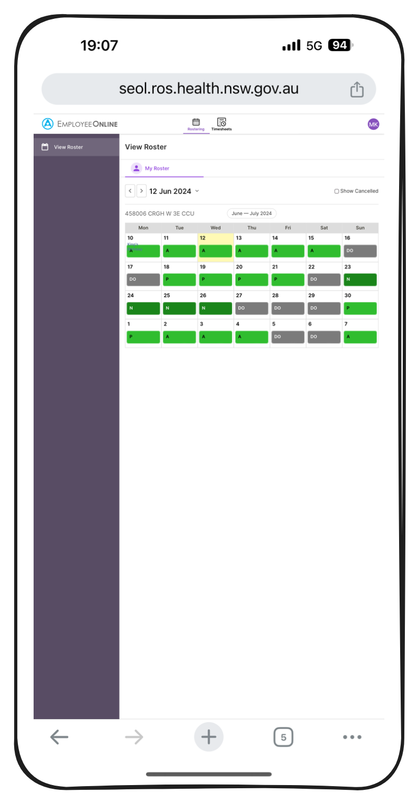
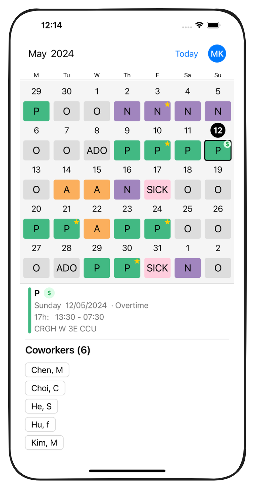

# Rosterr

Rosterr is a third-party iOS app for HealthRoster.

## Feature comparison

|                     | HealthRoster                       | Rosterr                          |
| ------------------- | ---------------------------------- | -------------------------------- |
| Mobile access       | Not optimised for mobile           | Mobile-friendly (iOS only)       |
| Shift data          | Original                           | No need to manually enter shifts |
| Shift display       | No color difference between shifts | Color-coded shifts               |
| Coworker visibility | No ❌                              | Yes ✅                           |
| Login               | Required each time                 | Required only once               |

## Screenshots

  
  

## Usage Comparison

| HealthRoster                                    | Rosterr                                          |
| ----------------------------------------------- | ------------------------------------------------ |
| 1. Open a web browser.                          | 1. Open an iOS app.                              |
| 2. Go to the HealthRoster website.              | [2. Log in once.]                                |
| 3. Log in to HealthRoster (required each time). | 3. View the roster with above mentioned feature. |
| 4. View the roster.                             |                                                  |

## Note

Use of this app is tax deductible.

## Privacy Policy

[Privacy Policy](privacy-policy.md)

## Contact

Twitter: https://x.com/healthrosterr

Email: healthrosterr@gmail.com
