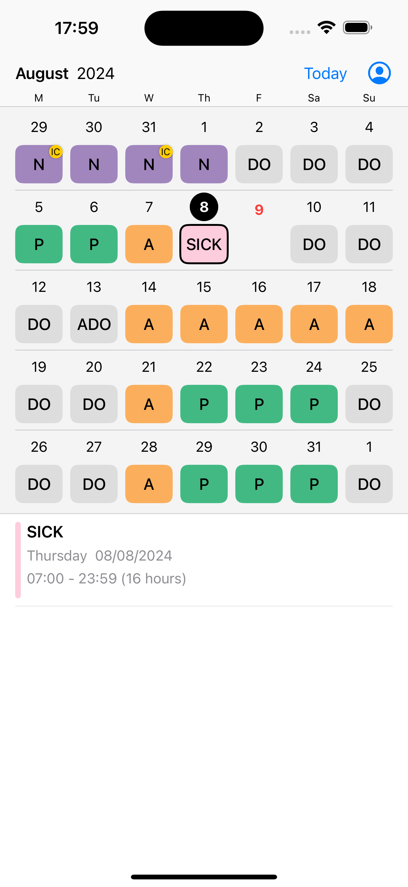

# ⚠️ Roster app is temporarily unavailable on the App Store. This has been in effect since 29/08/2024, 17:20.

# Roster

Roster is a third-party iOS app for HealthRoster.

## Feature comparison

|                     | HealthRoster                       | Roster                           |
| ------------------- | ---------------------------------- | -------------------------------- |
| Mobile access       | Not optimised for mobile           | Mobile-friendly (iOS only)       |
| Shift data          | Original                           | No need to manually enter shifts |
| Shift display       | No color difference between shifts | Color-coded shifts               |
| Coworker visibility | No ❌                              | Yes ✅                           |
| Login               | Required each time                 | Required only once               |

## Screenshots

## Usage Comparison

| HealthRoster                                    | Roster                                           |
| ----------------------------------------------- | ------------------------------------------------ |
| 1. Open a web browser.                          | 1. Open an iOS app.                              |
| 2. Go to the HealthRoster website.              | [2. Log in once.]                                |
| 3. Log in to HealthRoster (required each time). | 3. View the roster with above mentioned feature. |
| 4. View the roster.                             |                                                  |

## Note

- Only available for those who have access to HealthRoster using from within Australia.
- Shift information is frequently synced to HealthRoster, but may not be up to date at certain points
- Not all information accessible from HealthRoster is available in this app, e.g., notes, whether a shift has been changed after approval, etc.

## FAQ

**Is it safe to use?**

> Yes.
> Your information is securely stored in the [Keychain](<https://en.wikipedia.org/wiki/Keychain_(software)>), and is not shared with any other service.
> There is no intermediary server between this app and HealthRoster.
> Roster communicates with HealthRoster like your web browser does.

**Did we get approval from HealthRoster?**

> No.
> This is an unofficial third-party app that improves the experience of HealthRoster.
> Roster is still able to obtain your information because you logged in with your HealthRoster username and password.

**App is crashing or not showing data**

> - Try logging out and logging in again.
> - Delete and reinstall the app.
> - Email the author.

## Privacy Policy

[Privacy Policy](privacy-policy.md)

## Support

If you need assistance, have questions, or would like to provide feedback to the author, please use one of the following methods:

- Email the author: gimbapapps@gmail.com
- Open an issue on GitHub (if you have an account)
- Leave a review on the App Store
- Fill in the Google Forms: https://forms.gle/ErXimyrCtsRdiTkU7
