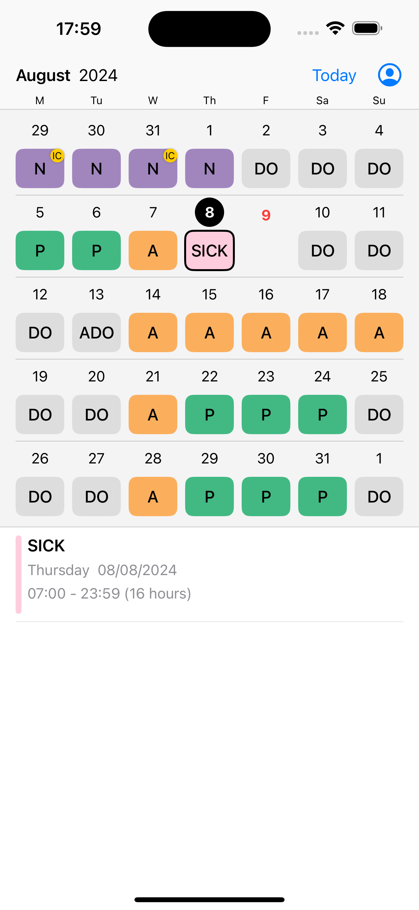

# Roster is a third-party iOS app for NSW HealthRoster.

## Feature comparison

|                     | HealthRoster                       | Roster                                 |
| ------------------- | ---------------------------------- | -------------------------------------- |
| Mobile access       | Not optimised for mobile           | Mobile-friendly (iOS only)             |
| Shift data          | Original                           | No need to manually enter shifts       |
| Shift display       | No color difference between shifts | Color-coded shifts                     |
| Coworker visibility | Hidden inside your browser         | Yes ✅                                 |
| Login               | Required each time                 | Required only once (until login fails) |

## Screenshots

## Usage Comparison

| HealthRoster                                    | Roster                                           |
| ----------------------------------------------- | ------------------------------------------------ |
| 1. Open a web browser.                          | 1. Open an iOS app.                              |
| 2. Go to the HealthRoster website.              | [2. Log in once.]                                |
| 3. Log in to HealthRoster (required each time). | 3. View the roster with above mentioned feature. |
| 4. View the roster.                             |                                                  |

## Note

- Only available for those who have access to HealthRoster using from within Australia.
- Shift information is frequently synced (Q1H) to HealthRoster, but may not be up to date at certain points
- Not all information accessible from HealthRoster is available in this app, e.g., notes, whether a shift has been changed after approval, etc.

## FAQ

**Is it safe to use?**

> Yes.
> Your information is securely stored in the [Keychain](<https://en.wikipedia.org/wiki/Keychain_(software)>).
> There is no intermediary server between this app and HealthRoster.
> Roster communicates with HealthRoster like your web browser does.

**Did we get approval from HealthRoster?**

> No.
> This is an unofficial third-party app that improves the experience of HealthRoster users.
> Roster is still able to obtain your information because you logged in with your HealthRoster username and password.

**App is crashing or not showing data**

> - Try logging out and logging in again.
> - Delete and reinstall the app.

**Did we 'fail to maintain the security of confidential and sensitive information by developing and releasing this app'?**

> No.
>
> 1. You can only see your own roster.
> 2. Coworker names were not obtained without consent. This information is already present in the browser when you use the NSW HealthRoster. We simply made it more accessible.
> 3. Being able to see who your coworkers are is one of your rights ([Know Your Rights by NSWNMA](https://www.nswnma.asn.au/wp-content/uploads/2023/08/Know-Your-Rights-A5-book.pdf#page=12))

**Will there be an Android version?**

> No, we currently have no plans to develop an Android version.

## Privacy Policy

[Privacy Policy](privacy-policy.md)

## Support

Email the author at gimbapapps@gmail.com for any inquiries or to share your feedback.

## How to support the App ❤️

- Give 5 stars on the App Store: [rate the app](https://apps.apple.com/au/app/roster/id6504712129?action=write-review&startRating=5)
- Tell your friends to try it out

